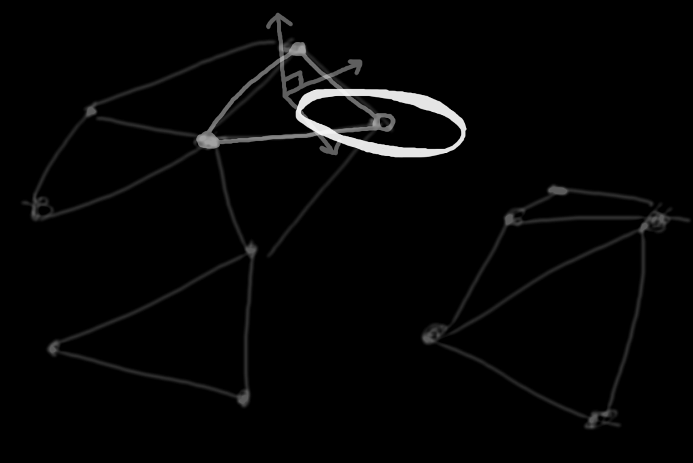
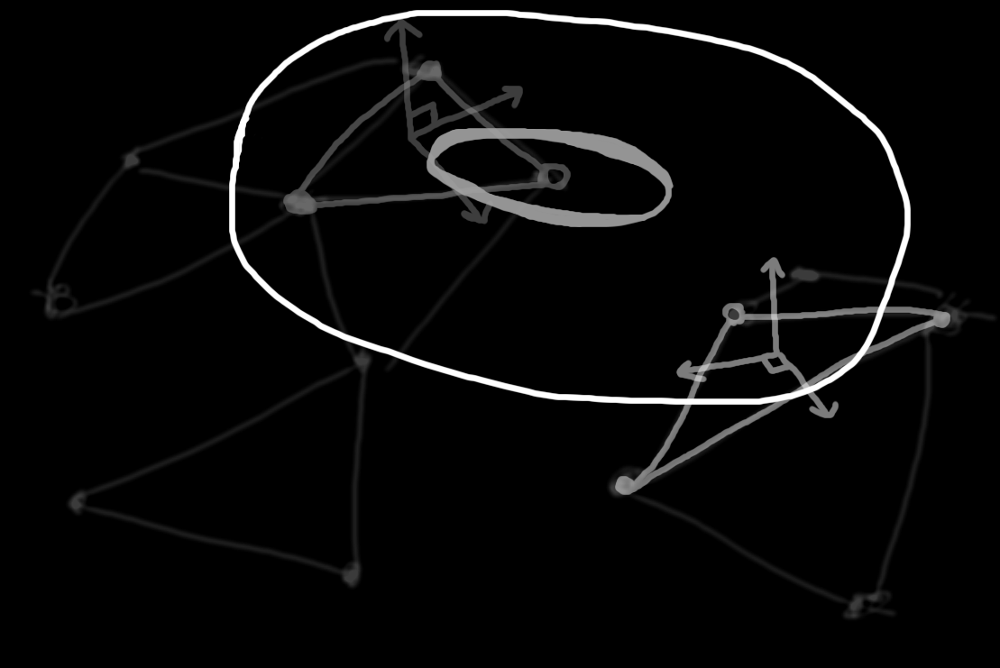

# Математическая часть

Первый шаг

Второй шаг

Третий шаг

## задача поиска ближайшего несвязного графа

## наиболее удаленные вершины этих графов 

## аппроксимировать две наиболее удаленных точки каждого графа и получить функцию, определяющую связанность двух графов
