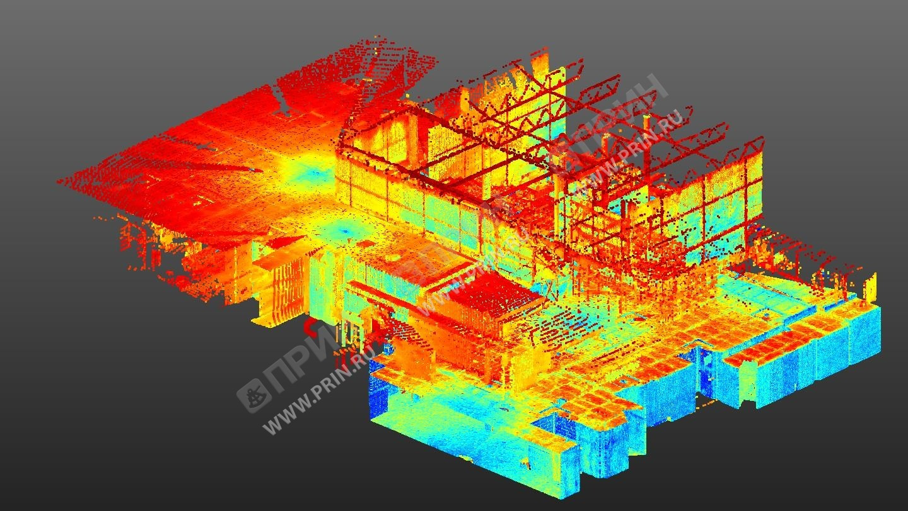
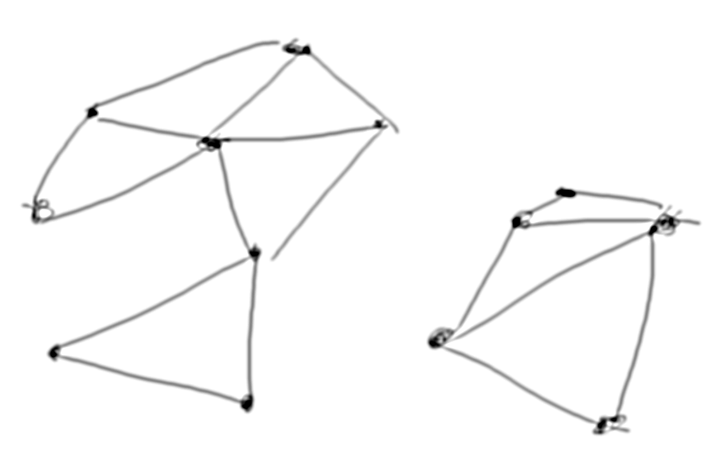
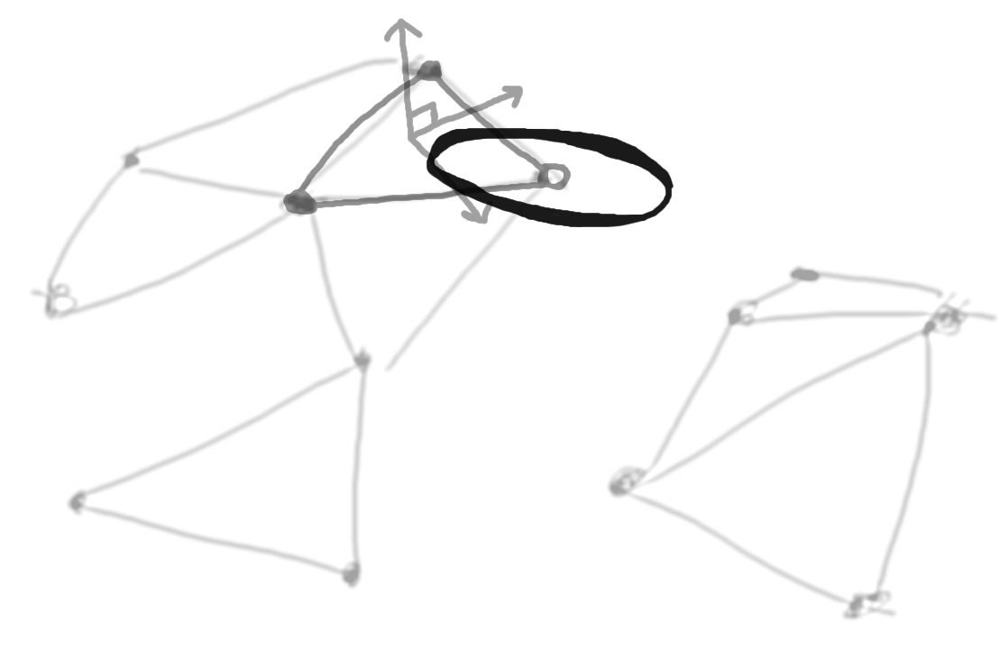
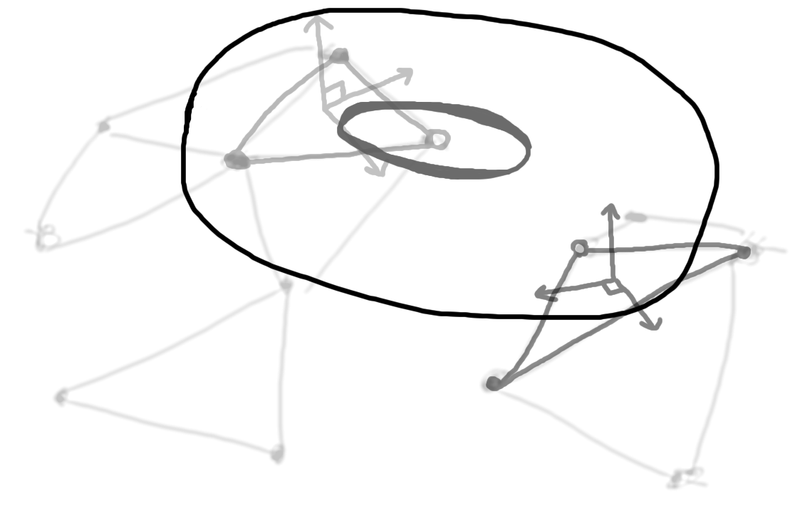

# Сравнение методов предварительной обработки трехмерного сканирования городского пространства

Рисунок 1 - лазерное сканирование территории

Создание компьютерных трехмерных моделей уже существующей городской среды является важным этапом проектирования новых зданий и реконструкции уже существующих. На текущем этапе развития технологий наиболее прогрессивные средства такого моделирования позволяют с высокой точностью производить сканирование среды, но последующая обработка (ручная или автоматическая) сырых данных требует больших вычислительных ресурсов. Поэтому существует задача оптимизации алгоритмов, позволяющих быстро и качественно выделять из сырых данных сканирования важную информацию и удалить все остальное.

Для решения этой задачи было принято решение сравнить затраты по времени и памяти алгоритмов:

1. Оптимизации
2. Основанных на машинном обучении

## Основные алгоритмы

### Задача поиска ближайшего несвязного графа

Рисунок 2 - модель на входе алгоритма

Рисунок 3 - первый этап поиска

Рисунок 3 - условие окончания поиска

### Наиболее удаленные вершины этих графов

?

### Аппроксимация двух наиболее удаленных точек каждого графа и получение функции, определяющей связанность двух графов

?

### Реализация обучения сети

?
